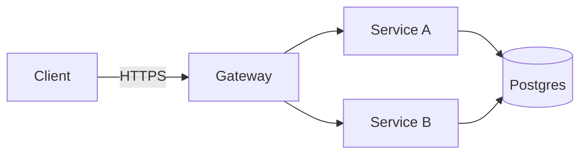

# Marp renderer cheat-sheet — `anvil:deck`

This is a one-page reference for the Marp configuration the deck skill
assumes. The framework-level pin lives at `anvil/lib/marp/config.yml` (in an
installed consumer repo: `.anvil/lib/marp/config.yml`); the per-document
pin lives in `templates/deck.md.j2`. This file is for the deck author who
just wants to know which figure path to pick and how to render the result.

## The three figure paths

`anvil:deck` ships exactly three figure paths. Use them in this order of
preference:

| Path | Source | Lives in `deck.md` as | When to use |
|---|---|---|---|
| **Matplotlib PNG** | `figures/src/<name>.py` + `figures/src/<name>.csv` | `` | Data charts (bar, line, scatter, distribution) — anything with axes and real numbers. |
| **Inline mermaid** | Fenced ```mermaid block directly in `deck.md` | (the block itself) | Architecture diagrams, sequence diagrams, flowcharts, state machines. **Default for diagrams.** |
| **MathJax** | Inline `$...$` or display `$$...$$` in `deck.md` | (inline source) | Any inline equation or formula. |

Each path has one minimal worked example below.

### Path 1 — Matplotlib PNG (data charts)

`figures/src/traction.py`:

```python
#!/usr/bin/env python3
import matplotlib.pyplot as plt
import pandas as pd
from pathlib import Path

SRC = Path(__file__).parent
OUT = SRC.parent / "traction.png"

df = pd.read_csv(SRC / "traction.csv")
fig, ax = plt.subplots(figsize=(12, 7), dpi=120)
ax.plot(df["month"], df["arr_k"], marker="o")
ax.set_title("ARR growth — Q1 2025 to Q2 2026")
ax.set_xlabel("Month")
ax.set_ylabel("ARR ($K)")
fig.tight_layout()
fig.savefig(OUT, dpi=150, bbox_inches="tight")
```

In `deck.md`:

```markdown
## Traction


```

`deck-figures` runs the script and produces the PNG. Matplotlib palette,
DPI, and `$`-escaping conventions are owned by
`assets/figure-conventions.md` (cross-reference).

### Path 2 — Inline mermaid (diagrams) — **default**

In `deck.md`, directly:

````markdown
## Solution architecture


````

That's it. Marp renders the mermaid block at PDF-export time. No `.mmd` file,
no `mmdc` invocation, no PNG, no out-of-band step. The figurer treats this
as a no-op.

This works because Marp emits the mermaid block as an inline `<script>`,
and `anvil/lib/marp/config.yml` pins `html: true` so the script survives
into the rendered output. The per-document frontmatter (`math: mathjax`,
`html: true` in `templates/deck.md.j2`) is the belt; the CLI config is the
suspenders.

**When to fall back to PNG** (the `mmdc → PNG` path):

- Custom geometry (mermaid's auto-layout can't fit the safe area).
- Transparent compositing (overlay on theme-colored background).
- Explicit marker — drop `<!-- anvil-figure: png -->` on the line above a
  ```mermaid fence to signal "render this one out-of-band."

See `commands/deck-figures.md` step 4 for the fallback procedure.

### Path 3 — MathJax (equations)

In `deck.md`, directly:

```markdown
## Unit economics

Lifetime value:

$$LTV = \frac{ACV \cdot \text{retention\_years}}{\text{gross\_margin}^{-1}}$$

…where retention is measured over $n \geq 3$ cohorts.
```

That's it. Marp renders MathJax inline at PDF-export time. No preprocessing,
no `pdflatex`, no external service. MathJax (Marp v3 default) covers a
wider LaTeX subset than KaTeX — most equations a fundraising deck needs
will render without escape characters or workarounds.

`math: mathjax` is pinned in the per-document frontmatter and at the CLI
config level. The matplotlib-side `$`-escape convention (`\$` for literal
dollar signs in axis labels) is owned by `assets/figure-conventions.md`
and is independent of the slide-level math engine.

## Canonical CLI render line

```bash
marp <thread>.{N}/deck.md \
  --pdf \
  --html \
  --config-file anvil/lib/marp/config.yml \
  --theme-set anvil/skills/deck/assets/anvil-deck.css \
  --allow-local-files \
  --output <thread>.{N}/deck.pdf
```

Three flags are load-bearing:

- `--html` enables the inline `<script>` blocks Marp emits for mermaid
  fences. Without it, mermaid diagrams disappear from the rendered PDF.
- `--config-file anvil/lib/marp/config.yml` pins the framework-shared
  options (`html`, `allowLocalFiles`, theme search path). Consumer repos
  resolve this to `.anvil/lib/marp/config.yml`.
- `--allow-local-files` lets Marp inline `` references.
  Without it, every embedded PNG renders as a broken-image icon.

The explicit `--html`, `--theme-set`, and `--allow-local-files` flags are
kept on the CLI line as belt-and-suspenders so the render still does the
right thing when the config file is missing or has been overridden.

## See also

- `anvil/lib/marp/config.yml` — canonical Marp config (single source of
  truth for the renderer pin).
- `anvil/lib/README.md` — "Marp renderer pin" section explains what is
  pinned and why each option is load-bearing.
- `anvil/skills/deck/templates/deck.md.j2` — per-document frontmatter that
  mirrors the config-file pin.
- `anvil/skills/deck/commands/deck-figures.md` — full figure pipeline
  including the inline-mermaid default and the `mmdc` PNG fallback.
- `anvil/skills/deck/lib/marp_lint.py` — `slide-content-overflow` lint that
  runs on the resulting markdown source (catches the figure + bullets + footer
  pattern that mermaid auto-layout cannot save).
- `anvil/skills/deck/assets/figure-conventions.md` — matplotlib `$`-escape
  conventions, palette, DPI defaults, transparency, and output-path
  discipline (the matplotlib side of the asset pipeline; this cheat-sheet is
  the mermaid/MathJax side).
