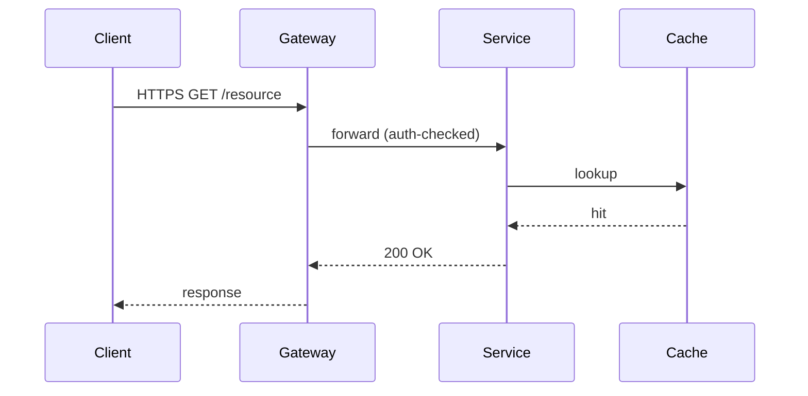

# Marp renderer cheat-sheet — `anvil:slides`

This is a one-page reference for the Marp configuration the slides skill
assumes. The framework-level pin lives at `anvil/lib/marp/config.yml` (in an
installed consumer repo: `.anvil/lib/marp/config.yml`); the per-document
pin lives in `templates/deck.md.j2`. This file is for the talk author who
just wants to know which figure path to pick and how to render the result.

## The three figure paths

`anvil:slides` ships exactly three figure paths. Use them in this order of
preference:

| Path | Source | Lives in `deck.md` as | When to use |
|---|---|---|---|
| **Matplotlib PNG** | `figures/<name>.py` + `figures/<name>.csv` | `` | Data plots (results, ablation tables, distributions, benchmark curves) — anything driven by a real dataset. |
| **Inline mermaid** | Fenced ```mermaid block directly in `deck.md` | (the block itself) | Architecture diagrams, sequence diagrams, system flows, protocol traces, state machines. **Default for diagrams.** |
| **MathJax** | Inline `$...$` or display `$$...$$` in `deck.md` | (inline source) | Theorem statements, equations, derivations, formal definitions. |

Each path has one minimal worked example below, tuned for a talk / lecture
audience.

### Path 1 — Matplotlib PNG (data plots)

`figures/benchmark.py`:

```python
#!/usr/bin/env python3
import matplotlib.pyplot as plt
import pandas as pd
from pathlib import Path

SRC = Path(__file__).parent
df = pd.read_csv(SRC / "benchmark.csv")

fig, ax = plt.subplots(figsize=(10, 6), dpi=120)
for method in df["method"].unique():
    sub = df[df["method"] == method]
    ax.plot(sub["epoch"], sub["accuracy"], marker="o", label=method)
ax.set_xlabel("Epoch")
ax.set_ylabel("Validation accuracy")
ax.set_title("Convergence — benchmark suite, 5 seeds")
ax.legend()
fig.tight_layout()
fig.savefig(SRC / "benchmark.png", dpi=150, bbox_inches="tight")
```

In `deck.md`:

```markdown
# Results


- All three methods converge by epoch 40.
- Method C dominates on the held-out partition (p < 0.01, paired t-test).
```

`slides-figures` runs the script and produces the PNG. Matplotlib palette,
DPI, and `$`-escaping conventions (for `\$` in axis labels) are owned by
issue #23's `figure-conventions.md` (cross-reference; not yet landed).

### Path 2 — Inline mermaid (diagrams) — **default**

A sequence diagram for a protocol walkthrough, directly in `deck.md`:

````markdown
# Protocol — request lifecycle



The cache hit avoids the database round-trip; tail latency drops from 180ms
to 12ms on the p99.
````

That's it. Marp renders the mermaid block at PDF-export time. No `.mmd`
file, no `mmdc` invocation, no PNG, no out-of-band step. The figurer treats
this as a no-op.

This works because Marp emits the mermaid block as an inline `<script>`,
and `anvil/lib/marp/config.yml` pins `html: true` so the script survives
into the rendered output. The per-document frontmatter (`math: mathjax`,
`html: true` in `templates/deck.md.j2`) is the belt; the CLI config is the
suspenders.

**When to fall back to PNG** (the `mmdc → PNG` path):

- Custom geometry (the diagram is too tall for the safe area at mermaid's
  default layout).
- Transparent compositing (overlay on a slide-background image).
- Explicit marker — drop `<!-- anvil-figure: png -->` on the line above a
  ```mermaid fence to signal "render this one out-of-band."

See `commands/slides-figures.md` § "Mermaid (default for diagrams)" for
the fallback procedure.

### Path 3 — MathJax (theorem statements and equations)

A worked theorem statement, directly in `deck.md`:

```markdown
# Convergence guarantee

**Theorem (informal).** Let $f: \mathbb{R}^d \to \mathbb{R}$ be
$\beta$-smooth and $\mu$-strongly convex. Gradient descent with step
size $\eta = 1/\beta$ converges linearly:

$$\| x_t - x^\star \|_2 \leq \left( 1 - \frac{\mu}{\beta} \right)^t \| x_0 - x^\star \|_2.$$

The condition number $\kappa = \beta / \mu$ controls the rate; ill-conditioned
problems converge slowly even with the optimal step size.
```

That's it. Marp renders MathJax inline at PDF-export time. No preprocessing,
no `pdflatex`, no external service. MathJax (Marp v3 default) covers a
wider LaTeX subset than KaTeX — most theorem statements and derivations a
talk needs will render without escape characters or workarounds.

`math: mathjax` is pinned in the per-document frontmatter and at the CLI
config level. The matplotlib-side `$`-escape convention (`\$` for literal
dollar signs in axis labels) is owned by issue #23 and is independent of
the slide-level math engine.

## Canonical CLI render line

```bash
marp <thread>.{N}/deck.md \
  --pdf \
  --html \
  --config-file anvil/lib/marp/config.yml \
  --theme-set anvil/skills/slides/templates/anvil-slides-theme.css \
  --allow-local-files \
  --output <thread>.{N}/deck.pdf
```

Three flags are load-bearing:

- `--html` enables the inline `<script>` blocks Marp emits for mermaid
  fences. Without it, mermaid diagrams disappear from the rendered PDF.
- `--config-file anvil/lib/marp/config.yml` pins the framework-shared
  options (`html`, `allowLocalFiles`, theme search path). Consumer repos
  resolve this to `.anvil/lib/marp/config.yml`.
- `--allow-local-files` lets Marp inline `` references.
  Without it, every embedded PNG renders as a broken-image icon.

The explicit `--html`, `--theme-set`, and `--allow-local-files` flags are
kept on the CLI line as belt-and-suspenders so the render still does the
right thing when the config file is missing or has been overridden.

The handout exporter (`slides-handout`) uses the same invocation plus
`--pdf-notes` for the notes-below layout.

## See also

- `anvil/lib/marp/config.yml` — canonical Marp config (single source of
  truth for the renderer pin).
- `anvil/lib/README.md` — "Marp renderer pin" section explains what is
  pinned and why each option is load-bearing.
- `anvil/skills/slides/templates/deck.md.j2` — per-document frontmatter
  that mirrors the config-file pin.
- `anvil/skills/slides/commands/slides-figures.md` — full figure pipeline
  including the inline-mermaid default and the `mmdc` PNG fallback.
- `anvil/skills/slides/commands/slides-handout.md` — handout exporter
  using the same canonical render line.
- `anvil/skills/slides/lib/marp_lint.py` — `slide-content-overflow` lint
  (re-exported from the deck-side single source of truth) that runs on the
  resulting markdown source.
- Issue #23 — matplotlib `$`-escape conventions, palette helpers, DPI
  defaults. Lands at `anvil/skills/deck/assets/figure-conventions.md`
  (cross-reference; out of scope for this skill's renderer cheat-sheet).
